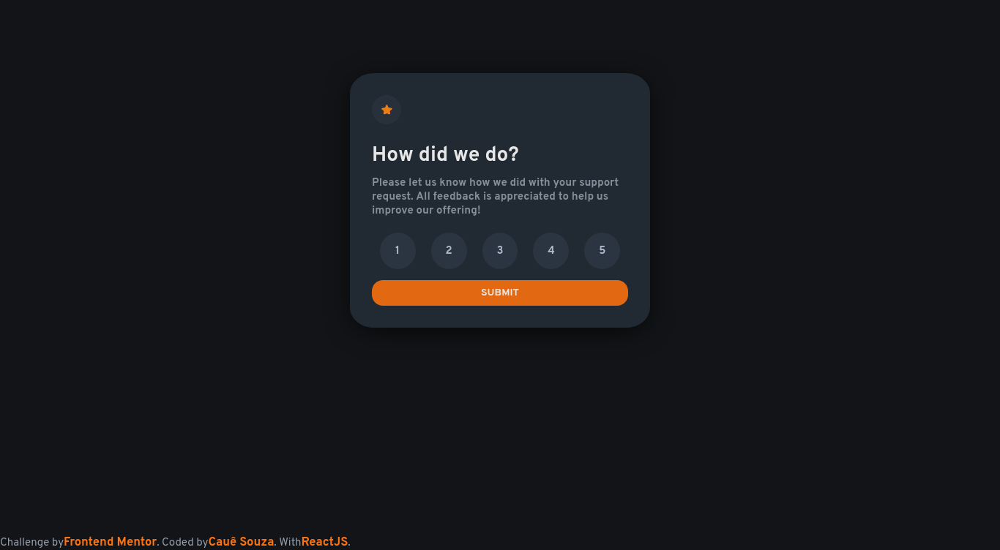

# Frontend Mentor - Interactive rating component solution

This is a solution to the [Interactive rating component challenge on Frontend Mentor](https://www.frontendmentor.io/challenges/interactive-rating-component-koxpeBUmI). Frontend Mentor challenges help you improve your coding skills by building realistic projects.

## Table of contents

- [Overview](#overview)
  - [The challenge](#the-challenge)
  - [Screenshot](#screenshot)
  - [Links](#links)
- [My process](#my-process)
  - [Built with](#built-with)
  - [What I learned](#what-i-learned)
  - [Useful resources](#useful-resources)
- [Author](#author)
- [LocalTest](#local-test)
## Overview

### The challenge

Users should be able to:

- View the optimal layout for the app depending on their device's screen size
- See hover states for all interactive elements on the page
- Select and submit a number rating
- See the "Thank you" card state after submitting a rating

### Screenshot



More screenshot in the folder

### Links

- Solution URL: [Github Repo](https://github.com/EuCaue/interactive-rating-component)
- Live Site URL: [Site(versel)](https://interactive-rating-component-main-qyiebtozt-eucaue.vercel.app/)

## My process

### Built with

- Semantic HTML5 markup
- CSS custom properties
- Flexbox
- [React](https://reactjs.org/) - JS library
- [React-Router-Dom](https://reactrouter.com/) - For the routes
- [Styled Components](https://styled-components.com/) - For styles
- [React-Toastify](https://fkhadra.github.io/react-toastify/introduction) - For notifications
- [Eslint](https://eslint.org/) - For better code patterns
### What I learned

```html
<li tabIndex={-1}>1</li>
```
```css
. -webkit-box-shadow: 0px 6px 36px -5px rgba(0,0,0,0.77);
  -moz-box-shadow: 0px 6px 36px -5px rgba(0,0,0,0.77);
  box-shadow: 0px 6px 36px -5px rgba(0,0,0,0.77);
```
```js
  const handleSubmit = (e) => {
    e.preventDefault();
    // Checking if no stars were given 💬
    if (!stars) return toast.info('Select a value');

    // Checking if the value does not correspond to a star 💬
    if (stars === '12345') {
      return toast.info('Error with the value, please select again.');
    }
    localStorage.setItem('stars', JSON.stringify(stars));

    // Navigate to the thanks page 💬
    navigate('/thanks');
    return true;
  };

}
```
### Useful resources

- [ReactJS DOCS](https://reactjs.org/)
- [W3Schools](https://www.w3schools.com/)

## Author

- Frontend Mentor - [@EuCaue](https://www.frontendmentor.io/profile/EuCaue)
- Github - [EuCaue](https://www.github.com/EuCaue)

### Local Test
<p>Clone the repo</p>
<code>
git clone https://github.com/EuCaue/interactive-rating-component.git
</code>
<p>
 Open the terminal inside of it
 </br>
 run <code>npm i</code>
 </br>
 Then click in <strong> localhost </strong>   with ctrl key pressed
